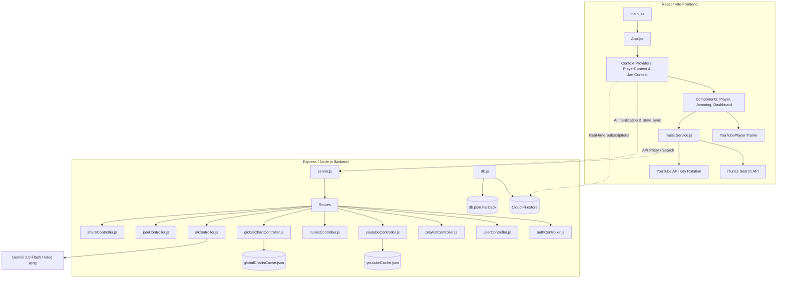
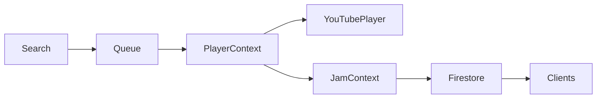

# Aurevon

An open-source music streaming platform focused on listener-first experiences.

Built with React 19, Node.js, Express, and Firebase, Aurevon combines modern music discovery, synchronized Jam Rooms, AI-powered recommendations, and unrestricted playback into a single collaborative platform.

Unlike traditional streaming services, Aurevon is built around one principle:

> Listening should never feel artificially limited.

[](LICENSE)
[](https://react.dev)
[](https://nodejs.org)
[](https://expressjs.com)
[](https://firebase.google.com)
[](https://vitejs.dev)
[](#contributing)
[](https://github.com/codebrak07/Aurevon/stargazers)
[](https://github.com/codebrak07/Aurevon/issues)

**Live app:** [aurevonmusic.vercel.app](https://aurevonmusic.vercel.app) &nbsp;•&nbsp;


---

## Core Philosophy

Aurevon is built around four principles.

- Listener-first.
- Open by default.
- Real-time collaboration.
- AI as assistance, never control.

Every architectural decision is measured against these principles.

---

## Table of Contents

- [Core Philosophy](#core-philosophy)
- [Vision](#vision)
- [Screenshots](#screenshots)
- [Features](#features)
- [Tech Stack](#tech-stack)
- [Design](#design)
- [Architecture](#architecture)
- [Architecture Principles](#architecture-principles)
- [State Flow](#state-flow)
- [Project Structure](#project-structure)
- [Getting Started](#getting-started)
- [Development](#development)
- [Development Philosophy](#development-philosophy)
- [API Overview](#api-overview)
- [Security](#security)
- [Performance](#performance)
- [Browser Support](#browser-support)
- [Roadmap](#roadmap)
- [Contributing](#contributing)
- [Contributors Wanted](#contributors-wanted)
- [Maintainers](#maintainers)
- [License](#license)
- [Final Note](#final-note)

---

## Vision

Most streaming platforms restrict free users not because of technical constraints, but because of business incentives. Skip limits, disabled looping, forced ad breaks, and crippled rewind behavior aren't engineering limitations — they're deliberate product decisions designed to push conversion to a paid tier.

Aurevon exists to prove that a music platform can be full-featured, collaborative, and intelligent without holding basic playback behavior hostage. It is built as a fully open-source alternative where:

- Playback controls (loop, seek, skip) are never artificially restricted
- Discovery and recommendations are powered by transparent, inspectable logic and AI, not opaque algorithms designed purely for engagement
- Listening with friends is a first-class feature, not an afterthought
- The codebase itself is open for anyone to learn from, fork, or build on

Aurevon isn't trying to be "another Spotify." It's trying to be what a listener-first platform looks like when the listener is actually the priority.

---

## Features

### Playback
- Unlimited looping on any track
- Instant seek/rewind — no forced restarts
- No skip limits, no interrupting ad breaks
- Persistent playback state across reloads (queue, position, volume, shuffle)
- Hidden YouTube Iframe engine for actual audio playback, abstracted behind a unified player interface

### Discovery
- Unified search merging iTunes Search API and YouTube results
- Custom scoring algorithm (`scoreUnifiedResult`) that favors official audio and filters out low-quality remixes, covers, and promos
- Global charts aggregated across 10 countries, refreshed and cached every 24 hours
- New releases and followed-artist release feeds

### Collaboration
- Live Jam Rooms with shareable room codes
- Real-time synchronized playback via Firestore `onSnapshot`, with HTTP polling fallback
- Vote-to-skip, host controls, and automatic host migration if the host disconnects
- Guest access — no account required to join a room

### Personalization
- Magic Vibe AI — describe a mood, genre, or moment and get a generated playlist
- Smart Shuffle and Magic Seeds for AI-assisted queue expansion
- Wrapped-style listening insights (top songs, artists, and vibes over time)
- Liked songs, custom playlists, followed artists, and listening history

### Platform
- Progressive Web App — installable, offline-capable via service worker caching
- Google and email authentication, with JWT-based sessions
- Shareable links for individual tracks
- Admin panel for user and platform statistics

---

## Tech Stack

**Frontend**
- React 19 + Vite
- Framer Motion for animation and gesture handling
- Tailwind CSS combined with a custom glassmorphic design system
- YouTube Iframe API as the underlying playback engine

**Backend**
- Node.js + Express 5
- JWT and BCrypt for authentication
- Google Cloud Firestore as the primary datastore, with a local JSON fallback for offline or credential-less development
- Firestore real-time subscriptions for Jam Room state sync

**AI**
- Gemini 2.0 Flash and Groq (Llama 3.1 8B) for Smart Shuffle, Magic Seeds, Magic Vibe generation, and chart vibe classification

**Infrastructure**
- Vercel for frontend and backend routing
- Cloudflare R2 for asset storage

---

## Design

Aurevon uses a custom glassmorphic design language focused on:

- Layered surfaces
- Smooth motion
- Minimal navigation
- Immersive playback
- Responsive layouts

---

## Architecture

<details>
<summary>Expand system architecture diagram</summary>



</details>

---

## Architecture Principles

**Firestore with a local JSON fallback.**
Firestore is the primary datastore because it provides real-time subscriptions out of the box, which Jam Rooms depend on for synchronized playback state. However, requiring every contributor to configure a Firebase project before they can run the app locally creates unnecessary friction. The backend's data layer (`backend/data/db.js`) detects whether Firebase Admin credentials are present and transparently falls back to a local `db.json` file if they aren't. This means the app is fully runnable offline, with no cloud dependency required to contribute.

**YouTube as the playback engine.**
Aurevon does not host or stream audio files directly. Instead, it resolves search results to YouTube video IDs and plays them through a hidden Iframe player. This avoids the licensing and infrastructure burden of hosting audio while still providing access to a near-complete catalog of officially released music. A scoring algorithm in `youtubeController.js` and `musicService.js` filters search results to prioritize official audio uploads and penalize remixes, covers, and promotional clips, so the experience feels closer to a licensed catalog than a raw video search.

**AI recommendations as an assistive layer, not a black box.**
Smart Shuffle, Magic Seeds, and Magic Vibe are implemented as discrete, callable backend operations (`aiController.js`) rather than an opaque recommendation pipeline. Each feature has a clear single responsibility — expanding a queue, generating seed tracks from a mood prompt, or classifying chart entries into vibe tags — so the AI layer stays inspectable and swappable rather than becoming an unauditable core dependency.

**Real-time sync with a polling fallback.**
Jam Rooms rely on Firestore's `onSnapshot` for low-latency state sync. Because not every deployment environment guarantees persistent WebSocket-like connections, `JamContext.jsx` falls back to HTTP polling if real-time subscriptions are unavailable, and can operate in a local-only room mode if the backend itself is unreachable. The goal is graceful degradation rather than a hard failure when infrastructure isn't perfectly available.

---

## State Flow

A simplified view of how a search turns into synchronized playback:



---

## Project Structure

<details>
<summary>Expand full project structure</summary>

```
Aurevon/
├── src/                        # Frontend source
│   ├── main.jsx                 # App entry, mounts root + PWA service worker
│   ├── App.jsx                  # Main shell, tab routing, providers
│   ├── context/
│   │   ├── PlayerContext.jsx    # Core audio engine (queue, playback, history)
│   │   └── JamContext.jsx       # Real-time collaboration engine
│   ├── hooks/                   # usePlayer, useDebounce
│   ├── config/                  # api.js, firebase.js
│   ├── services/                # musicService, youtubeService, aiService, etc.
│   ├── utils/                   # TrackNormalizer, mappers, silent audio, googleAuth
│   └── components/
│       ├── Player controls      # PlayerBar, SeekBar, Controls, NowPlaying, QueuePanel
│       ├── Navigation           # BottomNav, Sidebar
│       ├── Search               # SearchBar, SearchResults, TrackCard, ArtistCard
│       ├── Dashboard            # HomeGreeting, MagicVibe, TopMixes, NewReleases
│       ├── Library              # Library, QuickLibrary, GlobalDashboard
│       ├── Modals                # ProfileModal, ArtistProfileModal, AdminPanel, etc.
│       ├── Jamming/              # JammingHub, Lobby, LiveRoom
│       └── Wrapped/              # WrappedDashboard
│
├── backend/                     # Express backend
│   ├── server.js                 # App entry, CORS/JSON middleware, error boundaries
│   ├── config/                   # firebase-admin.js, r2.js, firebase-storage.js
│   ├── data/                     # db.js, db.json, cache.js
│   ├── middleware/                # authMiddleware.js, adminMiddleware.js
│   ├── routes/                   # auth, user, playlist, youtube, itunes, ai, jam, share, admin
│   ├── controllers/                # Business logic for each route group
│   └── scripts/                   # classifySongs, migrateToFirestore, jamSimulations
│
├── firestore.rules               # Firestore security rules
├── firestore.indexes.json        # Firestore composite indexes
├── firebase.json                 # Firebase CLI deploy config
├── vercel.json                   # Vercel routing config
├── vite.config.js                # Vite + PWA plugin config
└── .env.example                  # Environment variable template
```

</details>

---

## Getting Started

### Prerequisites
- Node.js 18 or later
- npm (or a compatible package manager)
- Optional: a Firebase project with Firestore enabled — the app falls back to local JSON storage if credentials aren't provided
- Optional: API keys for YouTube Data API, Gemini, and Groq for AI-powered features

### Installation

```bash
git clone https://github.com/codebrak07/Aurevon.git
cd Aurevon
npm install
```

### Environment Setup

```bash
cp .env.example .env
```

Configure the following in `.env`:

| Variable | Purpose |
|---|---|
| Firebase client config | Frontend Firestore + Auth access |
| Firebase Admin credentials | `backend/config/firebase-credentials.json` — omit to run in local JSON fallback mode |
| YouTube Data API key(s) | Track resolution and search |
| Gemini API key | Magic Vibe, chart vibe classification |
| Groq API key | Smart Shuffle, Magic Seeds |
| Google OAuth client ID | Google sign-in |

---

## Development

```bash
# Run the frontend only (Vite dev server)
npm run dev

# Run the backend only (Express server)
npm run server

# Run both concurrently
npm run dev:all

# Lint the codebase
npm run lint

# Build for production
npm run build

# Preview a production build locally
npm run preview
```

The frontend communicates with the backend through `src/config/api.js`, which resolves to `localhost` in development and to the deployed API URL in production.

### Deployment

Aurevon is configured for single-command deployment on Vercel. `vercel.json` routes the Vite frontend at `/` and the Express backend at `/_/backend`. Firestore rules and indexes are deployed independently via the Firebase CLI:

```bash
firebase deploy --only firestore
```

---

## Development Philosophy

This repository values:

- Readable code over clever code
- Progressive enhancement
- Graceful degradation
- Offline-friendly architecture
- Component isolation
- Explicit APIs
- Long-term maintainability

---

## API Overview

All backend routes are mounted under `/api`.

| Route prefix | Responsibility |
|---|---|
| `/api/auth` | Signup, login, Google OAuth, Firebase token login |
| `/api/user` | Profile fetch, local-to-cloud sync, profile updates |
| `/api/playlist` | Playlist creation, track add/remove, deletion |
| `/api/youtube` | YouTube search and track resolution |
| `/api/itunes` | iTunes search, India Top 100, global chart data |
| `/api/ai` | Prompt refinement, recommendations, smart shuffle, magic seeds, top mixes |
| `/api/jam` | Room creation/join, queue management, vote-skip, playback control, heartbeats |
| `/api/share` | Shareable track link creation and resolution |
| `/api/admin` | User listing and platform statistics (admin-only) |

Authentication middleware verifies JWT or Firebase ID tokens and attaches the resolved `userId` to each request. Jam Room endpoints additionally support guest IDs, since participation does not require an account.

---

## Security

- Passwords are hashed with BCrypt before storage; plaintext credentials are never persisted
- Authenticated requests are verified via JWT or Firebase ID tokens through `authMiddleware.js`
- Admin routes are gated behind an email allowlist in `adminMiddleware.js`
- Firestore security rules restrict user profile documents to their authenticated owner and force all Jam Room writes through the backend (`allow write: if false` on the client), while still permitting real-time read subscriptions
- API keys (YouTube, Gemini, Groq) support rotation to reduce the impact of individual key exhaustion or compromise

If you discover a security issue, please open a private report rather than a public issue where possible.

---

## Performance

- YouTube search results are cached (`youtubeCache.json`) with a 24-hour TTL to avoid redundant, expensive API calls
- Global chart data is aggregated from 10 country RSS feeds in parallel and cached for 24 hours rather than recomputed per request
- Search input is debounced client-side to prevent request spam while typing
- Playback state is persisted to local storage so reloads don't interrupt the listening session
- The frontend is a Progressive Web App with service worker caching for faster repeat loads and partial offline support

---

## Browser Support

Aurevon targets modern evergreen browsers with support for the YouTube Iframe API, Service Workers, and the Firestore Web SDK:

- Chrome/Edge (latest 2 versions)
- Firefox (latest 2 versions)
- Safari (latest 2 versions)
- Mobile Safari and Chrome for Android

Older browsers without Service Worker support will still be able to stream music, but PWA install and offline caching will not be available.

---

## Roadmap

- [ ] Native mobile app shell (iOS/Android)
- [ ] Offline downloads for liked songs and playlists
- [ ] Cross-device playback handoff
- [ ] Expanded Jam Room permissions (co-host roles, queue locking)
- [ ] Public API documentation with OpenAPI spec
- [ ] Automated test coverage for backend controllers
- [ ] Self-hosting guide with Docker Compose
- [ ] Additional metadata providers beyond iTunes/YouTube
- [ ] Accessibility audit and improvements (screen reader support, keyboard navigation)

Have an idea that isn't listed here? Open an issue to discuss it.

---

## Contributing

Aurevon is under active development and contributions are welcome at any level of experience.

1. Fork the repository
2. Create a feature branch: `git checkout -b feature/your-feature`
3. Make your changes and commit: `git commit -m "Add your feature"`
4. Push to your fork and open a pull request

Please open an issue before starting work on a large feature so it can be discussed first. Small fixes and improvements are welcome as direct pull requests.

---

## Contributors Wanted

Areas where help would be especially valuable:

- **Testing** — unit and integration tests for backend controllers, particularly `jamController.js` and `aiController.js`
- **Accessibility** — keyboard navigation, screen reader support, and color contrast review
- **Mobile experience** — refining touch interactions and PWA install flows on iOS
- **Documentation** — API reference docs, contribution guides, and setup walkthroughs for new environments
- **Internationalization** — UI translation and locale-aware formatting
- **DevOps** — Docker Compose setup for easier self-hosting
- **Design** — additional themes beyond the current glassmorphic dark mode

If any of these interest you, open an issue or comment on an existing one to get started.

---

## Maintainers

**Brak**
GitHub: [https://github.com/codebrak07](https://github.com/codebrak07)

Contributions are welcome.

---

## License

Open source, licensed under the MIT License. See [LICENSE](LICENSE) for full details.

---

## Final Note

Aurevon started as an experiment.

It became a platform.

Now it's a community project.

If you believe music software should put listeners first, you're welcome here.

Whether you submit a pull request, report a bug, improve the documentation, or simply star the repository, you're helping shape what Aurevon becomes.

See you in the next commit.

— Brak
